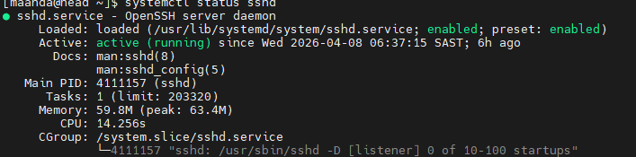
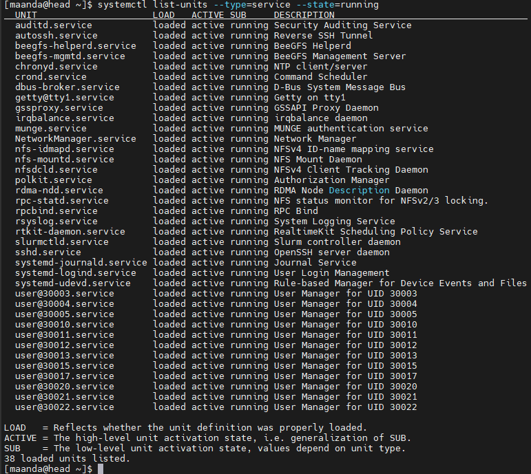
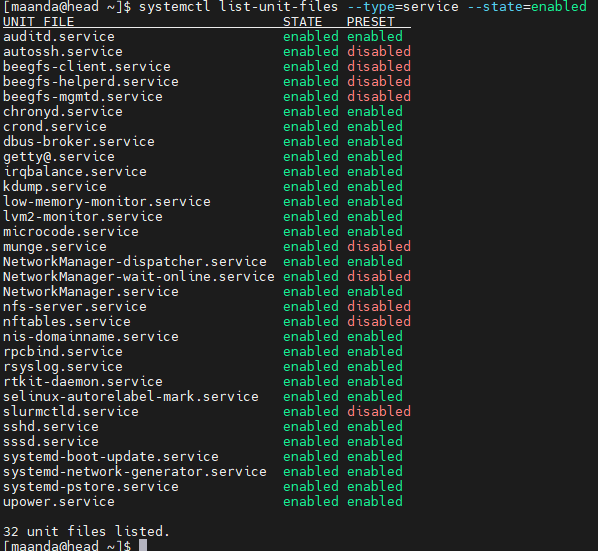
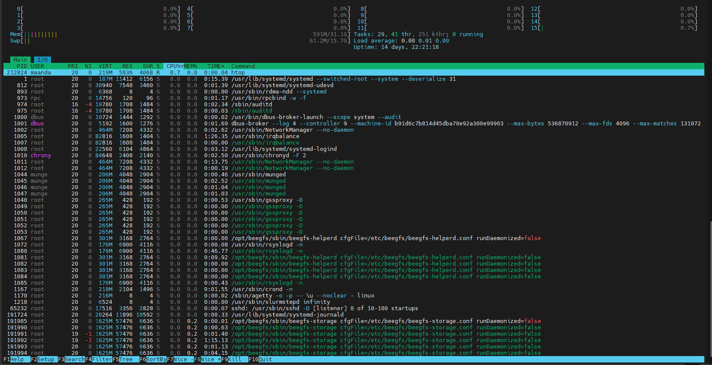
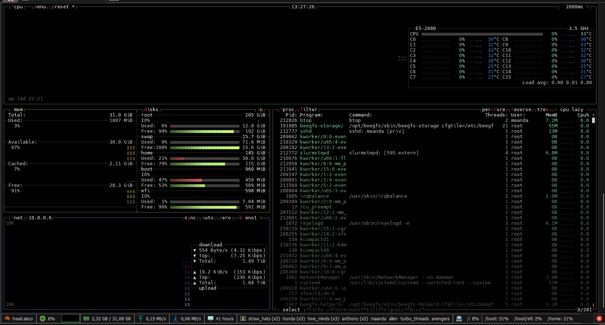
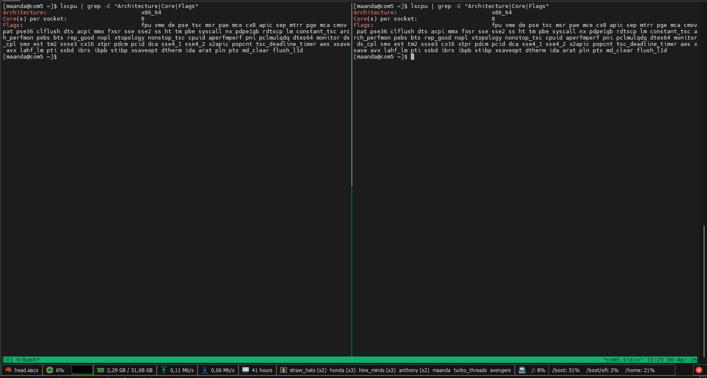
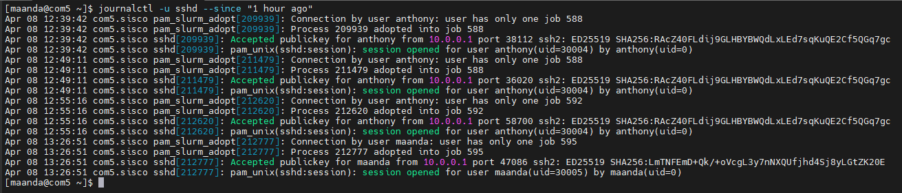

# Task 2

## SSH Service Status - Head Node

## Enabled and Running Services
### Running Services

### Enabled Services

## SSH Process on Com5 (Was the only one allocated)
### htop

### btop

## CPU Details (Com5) on tmux
### Use lscpu and the grep command to get the CPU details of head and com2

## SSH logs (last hour)

